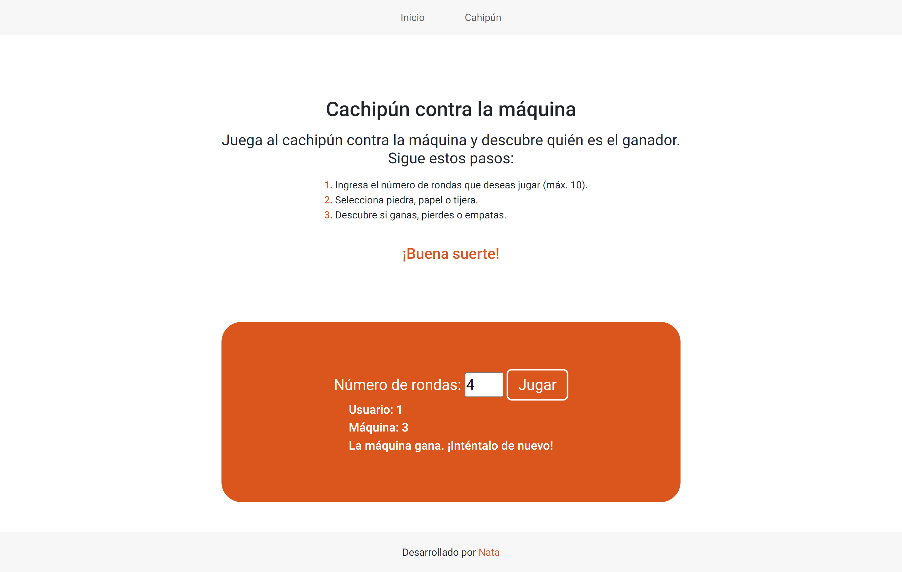
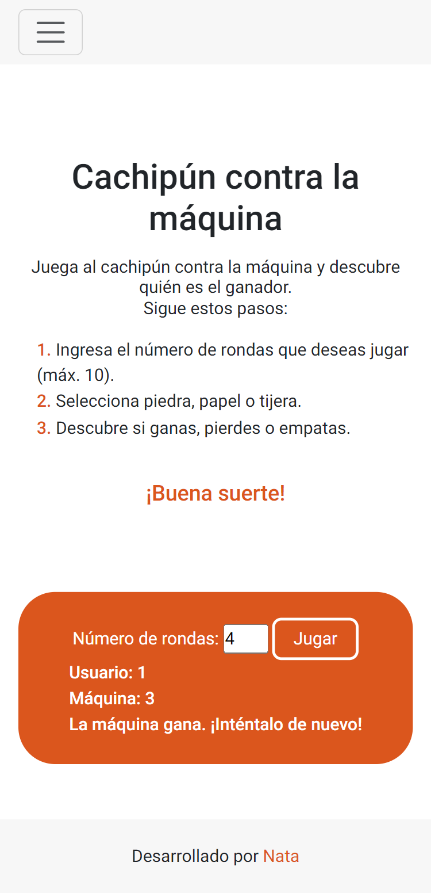

# Desafío - Cachipún contra la máquina




## Descripción

Aplicando los conceptos y herramientas aprendidas hasta ahora crea un programa que le permita a una persona jugar al cachipún contra el computador, indicando cuántas veces desea jugar o repetir el juego. El cachipún es un juego entre dos personas (en este caso, tú y el computador) donde cada una de ellas de manera independiente y secreta debe elegir una de las opciones (piedra, papel y tijera) y compararla con la opción de la otra persona. Para determinar quien gana, se deben seguir las siguientes reglas:

● Tijera le gana a papel
● Papel le gana a piedra
● Piedra le gana a tijera
● Si ambos jugadores eligen la misma opción es un empate

## Requerimientos

1. Solicitar al usuario las veces que desea que se repita el juego consecutivamente, es decir, cuántas veces deberá jugar contra la computadora. Por cada juego, se debe mostrar el resultado inmediatamente y luego pedir nuevamente una respuesta dependiendo de las veces que haya indicado el usuario que desea jugar.

2. Solicitar al usuario que indique su jugada (1 Punto).
Las opciones son las siguientes:
● Piedra
● Papel
● Tijera

3. Generar una jugada automática para la máquina usando la función Math.random() de Javascript.

4. Definir a un ganador considerando la jugada del usuario y la generada automáticamente para la máquina.

5. Indicar el resultado de la partida dependiendo del caso:
● Felicitar al ganador en caso de ser el usuario.
● Indicarle al usuario que ha perdido contra la máquina en caso de que ésta sea la que gane.
● Declarar un empate.

Consideraciones y recomendaciones En Javascript, se pueden crear números aleatorios usando la función Math.random(). Con el siguiente código, se pueden obtener números aleatorios entre 0 y 2.

```js
Math.floor(Math.random()*3)
```

Usa esta función para determinar la jugada de la máquina, dado que los resultados de esta función pueden ser 0, 1 ó 2, puedes asumir que cada uno de estos números corresponde a una jugada (piedra, papel o tijeras) y así definir la jugada de la máquina.